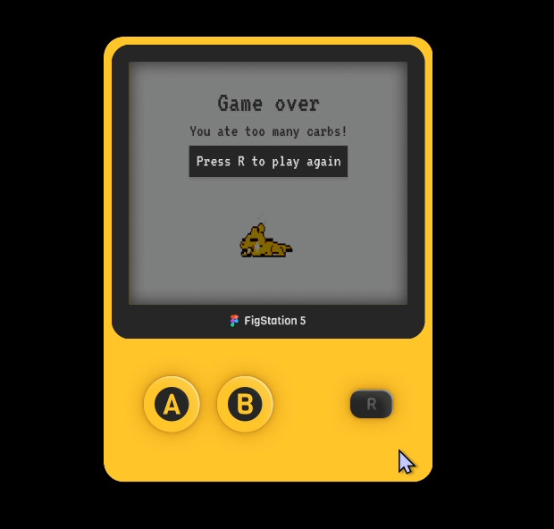
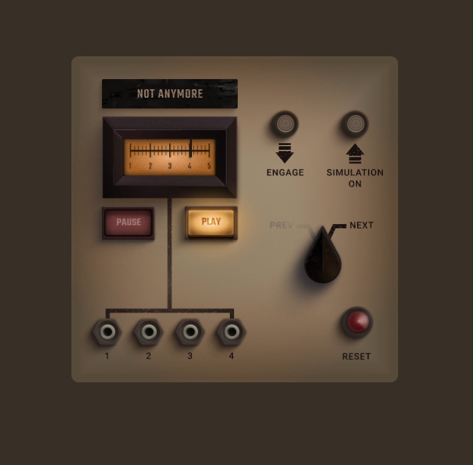
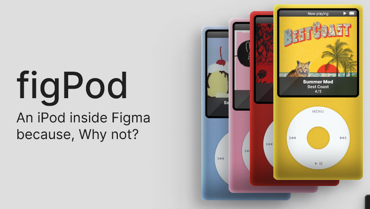

# 👀 Hi there
I’m Valentina, I work as a product designer but I have other projects that make 0 money but they are fun to do anyways. None of the things are done are really done but here are some:

--
## Figma community projects

**🕹️ Figma Virtual pet:** A small experiment using Figma variables. Press A to train this little guy and B to feed him. [Link](https://www.figma.com/community/file/1295458497620714216)

**🎧 NIN Machine:** A small tutorial on how to create a music player using Figma variables and more! [Link](https://www.figma.com/community/file/1295494144732353303)

**📱 FigPod:** NiN machine’s 2000s brother. A working Ipod in Figma. [Link](https://www.figma.com/community/file/1299737940089716518)

---
## Unlock Medium article extension

This is a Firefox extension that will create a link to the full article. Only available for Firefox because the Chrome store wanted to charge me like 10 bucks for this, and I honestly just made it in 20 mins for myself and published it in case anybody else may find it useful. [Extension Link](https://addons.mozilla.org/en-US/firefox/addon/unlock-medium-article/?utm_source=addons.mozilla.org&utm_medium=referral&utm_content=search)

---
**Some links:**
💼 [Linkedin](https://www.linkedin.com/in/valentinaazocar/) | 
🍎 [Figma community profile](https://www.figma.com/@azocar) | 
🖼️ [Behance](https://www.behance.net/valentinaazocar#) | 
📷 [Instagram](https://www.instagram.com/drtamagotchi/) | 
📽️ [TikTok](https://www.tiktok.com/@drtamagotchi)
